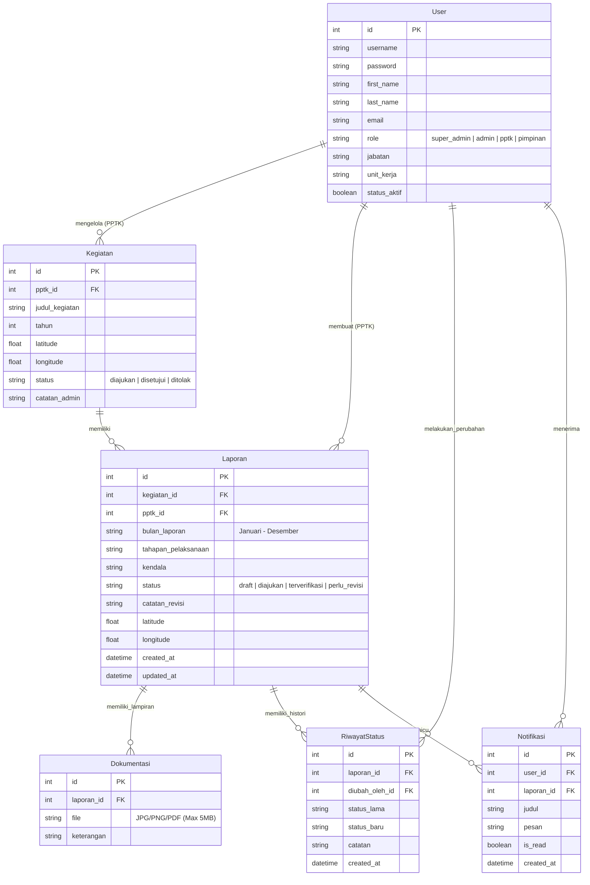
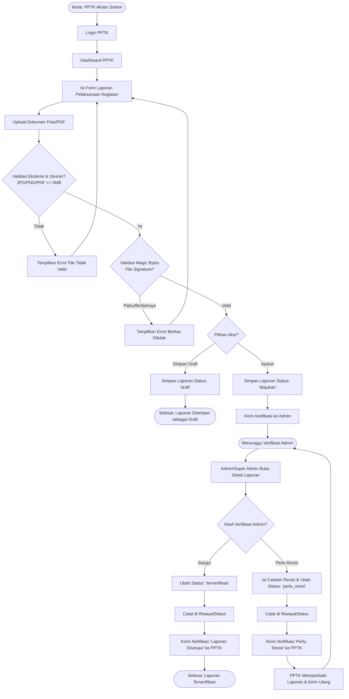
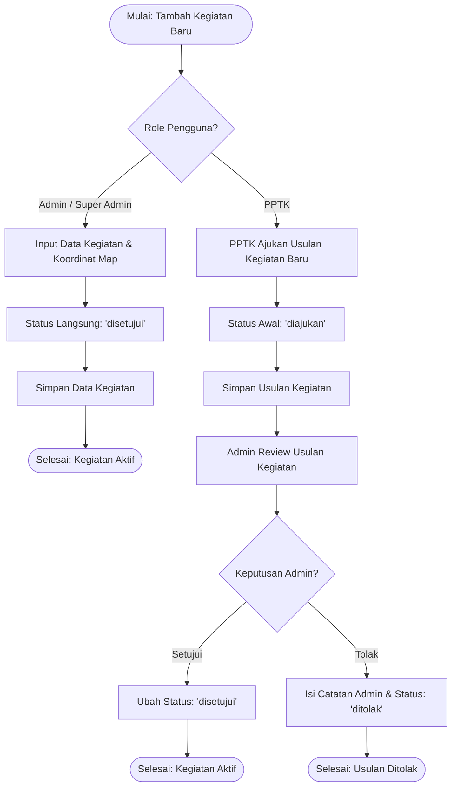
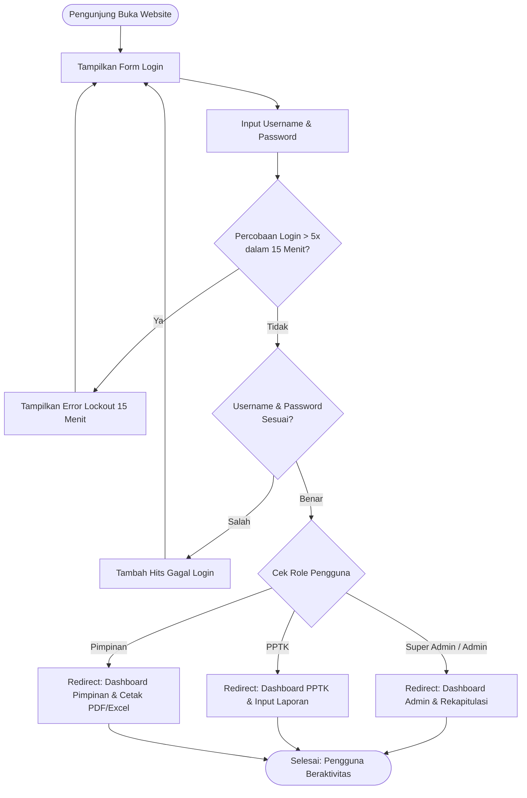

# 📐 Dokumentasi ERD & Flowchart - SIPAWAS (Sistem Pelaporan Disperkim)

Dokumentasi ini berisi **Entity Relationship Diagram (ERD)**, **Flowchart Alur Kerja (Workflows)**, serta **Spesifikasi Basis Data** untuk aplikasi **SIPAWAS** (*Sistem Pelaporan Pelaksanaan Kegiatan Dinas Perkim*).

---

## 📑 Daftar Isi
1. [Entity Relationship Diagram (ERD)](#1-entity-relationship-diagram-erd)
2. [Flowchart Sistem](#2-flowchart-sistem)
   - [A. Alur Pengajuan & Verifikasi Laporan](#a-flowchart-alur-pengajuan--verifikasi-laporan-core-process)
   - [B. Alur Persetujuan Usulan Kegiatan](#b-flowchart-persetujuan-usulan-kegiatan-baru-master-data)
   - [C. Alur Autentikasi & Hak Akses (RBAC)](#c-flowchart-autentikasi--hak-akses-pengguna-rbac)
3. [Spesifikasi Tabel Database](#3-spesifikasi-tabel-database)
4. [Matriks Hak Akses Pengguna (Role Matrix)](#4-matriks-hak-akses-pengguna-role-matrix)

---

## 1. Entity Relationship Diagram (ERD)

Diagram berikut menjelaskan entitas, atribut, tipe data, serta hubungan antar tabel pada database Django.

---

## 2. Flowchart Sistem

### A. Flowchart Alur Pengajuan & Verifikasi Laporan (Core Process)

Diagram ini menggambarkan alur kerja pembuatan laporan oleh **PPTK**, validasi keamanan berkas (*Magic Bytes File Signature*), hingga proses verifikasi/revisi oleh **Admin**.

---

### B. Flowchart Persetujuan Usulan Kegiatan Baru (Master Data)

Diagram ini menggambarkan alur penambahan data kegiatan baru oleh PPTK maupun Admin.

---

### C. Flowchart Autentikasi & Hak Akses Pengguna (RBAC)

Diagram ini menggambarkan alur autentikasi login, fitur keamanan *Rate Limiting IP*, serta pembagian halaman dashboard berdasarkan hak akses role.

---

## 3. Spesifikasi Tabel Database

### 1. Tabel `User` (`pelaporan_user`)
| Field | Tipe Data | Keterangan |
| :--- | :--- | :--- |
| `id` | BigAutoField (PK) | Primary Key |
| `username` | VarChar(150) | Unique ID pengguna |
| `password` | VarChar(128) | Hashed password |
| `role` | VarChar(20) | Enum: `super_admin`, `admin`, `pptk`, `pimpinan` |
| `jabatan` | VarChar(100) | Jabatan struktural |
| `unit_kerja` | VarChar(100) | Bidang / Unit kerja |
| `status_aktif` | Boolean | True jika akun aktif |

### 2. Tabel `Kegiatan` (`pelaporan_kegiatan`)
| Field | Tipe Data | Keterangan |
| :--- | :--- | :--- |
| `id` | BigAutoField (PK) | Primary Key |
| `pptk_id` | ForeignKey (User) | Penanggung jawab PPTK |
| `judul_kegiatan` | VarChar(255) | Nama paket/kegiatan |
| `tahun` | Integer | Tahun anggaran |
| `latitude` | Float (Nullable) | Koordinat peta |
| `longitude` | Float (Nullable) | Koordinat peta |
| `status` | VarChar(20) | Enum: `diajukan`, `disetujui`, `ditolak` |
| `catatan_admin` | Text | Catatan persetujuan/penolakan admin |

### 3. Tabel `Laporan` (`pelaporan_laporan`)
| Field | Tipe Data | Keterangan |
| :--- | :--- | :--- |
| `id` | BigAutoField (PK) | Primary Key |
| `kegiatan_id` | ForeignKey (Kegiatan) | Paket kegiatan terkait |
| `pptk_id` | ForeignKey (User) | Pembuat laporan |
| `bulan_laporan` | VarChar(20) | Bulan pelaksanaan |
| `tahapan_pelaksanaan` | Text | Uraian capaian fisik/pekerjaan |
| `kendala` | Text | Kendala lapangan (jika ada) |
| `status` | VarChar(20) | Enum: `draft`, `diajukan`, `terverifikasi`, `perlu_revisi` |
| `catatan_revisi` | Text | Catatan dari admin jika perlu revisi |
| `latitude` | Float (Nullable) | Koordinat lintang dokumentasi lapangan |
| `longitude` | Float (Nullable) | Koordinat bujur dokumentasi lapangan |
| `created_at` | DateTime | Waktu pembuatan |
| `updated_at` | DateTime | Waktu update terakhir |

### 4. Tabel `Dokumentasi` (`pelaporan_dokumentasi`)
| Field | Tipe Data | Keterangan |
| :--- | :--- | :--- |
| `id` | BigAutoField (PK) | Primary Key |
| `laporan_id` | ForeignKey (Laporan) | Relasi ke laporan |
| `file` | FileField | Path file foto/PDF terupload |
| `keterangan` | VarChar(255) | Deskripsi singkat foto/berkas |

### 5. Tabel `RiwayatStatus` (`pelaporan_riwayatstatus`)
| Field | Tipe Data | Keterangan |
| :--- | :--- | :--- |
| `id` | BigAutoField (PK) | Primary Key |
| `laporan_id` | ForeignKey (Laporan) | Laporan yang diubah |
| `diubah_oleh_id` | ForeignKey (User) | Pengubah status |
| `status_lama` | VarChar(20) | Status sebelum diubah |
| `status_baru` | VarChar(20) | Status setelah diubah |
| `catatan` | Text | Catatan perubahan |
| `created_at` | DateTime | Waktu pencatatan log |

### 6. Tabel `Notifikasi` (`pelaporan_notifikasi`)
| Field | Tipe Data | Keterangan |
| :--- | :--- | :--- |
| `id` | BigAutoField (PK) | Primary Key |
| `user_id` | ForeignKey (User) | Penerima notifikasi |
| `laporan_id` | ForeignKey (Laporan) | Laporan terkait (optional) |
| `judul` | VarChar(255) | Judul notifikasi |
| `pesan` | Text | Isi pesan notifikasi |
| `is_read` | Boolean | Status dibaca |
| `created_at` | DateTime | Waktu kirim |

---

## 4. Matriks Hak Akses Pengguna (Role Matrix)

| Fitur / Modul | Super Admin | Admin | PPTK | Pimpinan |
| :--- | :---: | :---: | :---: | :---: |
| **Manajemen Pengguna (User Management)** | ✅ | ✅ | ❌ | ❌ |
| **Kelola Master Data Kegiatan** | ✅ | ✅ | 🟡 (Usul saja) | 👁️ (Lihat) |
| **Persetujuan Usulan Kegiatan** | ✅ | ✅ | ❌ | ❌ |
| **Buat / Edit / Hapus Draft Laporan** | ❌ | ❌ | ✅ (Milik sendiri) | ❌ |
| **Verifikasi & Revisi Laporan** | ✅ | ✅ | ❌ | ❌ |
| **Lihat Dashboard & Rekapitulasi** | ✅ | ✅ | ✅ | ✅ |
| **Cetak PDF & Export Excel** | ✅ | ✅ | ✅ | ✅ |
